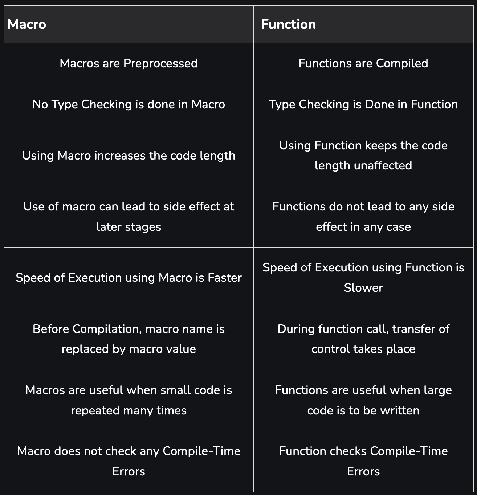
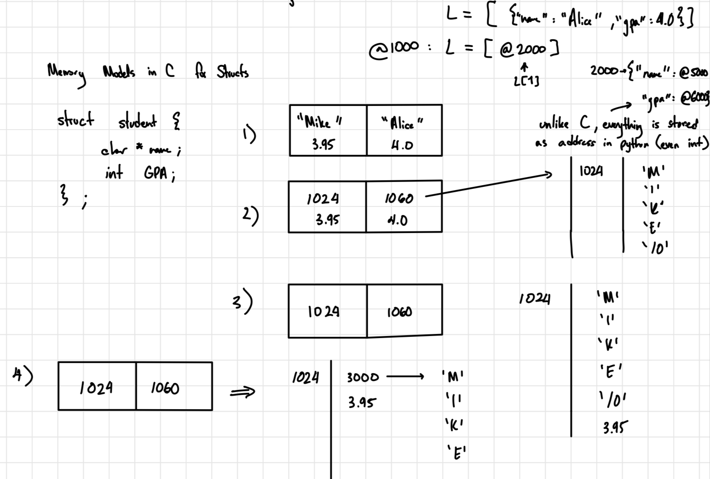

## Interpreted vs Compiled Languages

Python is an interpreted language, meaning writing python file.py runs a script itself that executes code block by block

Machine Code $\rightarrow$ Moving and writing data to memory addresses

A compiler takes hunan-readable code and translates it to machine code.
The lower level language, the easiar it is to translate into machine code. The less abstraction it has. Ex - For loops and functions are an abstraction.

C for loops include more detail to make it less abstract

Typical workflow for high level CS:
- Write in Python
- Figure out the ineffecient part of the program
- Write that part in C

## To run c
```bash
gcc -o build/jan18 jan18.c -lm
./build/jan18
```
gcc: The compiler that converts c code to an executable
-o path/filename: Specify the name of executable file and where you want it to live (could name jan18.exe or jan18, both will produce an executable)
jan18.c: The c file to compile
-lm: Linker option (links the math library)

### Header Files
Header files are a way of saying, take all this code in a header file and copy to the file I'm including it in.
```c
#include "filename.h"
```

Make sure the file your trying to include is in the same file. Otherwise, the gcc command try to compile, but can't find the included file.

Include math library: tasks.json -> args -> "-lm"

### Pre-processor
Code that runs before being compiled
```c
#include
#define <name> <value> //search and replace all references of name to value in the code
#define Cube(b) b*b*b //a macro (way to pre-process a function)
```

Can cause hard to fix compile errors since there is no type checking



## Memory
An 8Gb computer has $8*10^9$ bytes (aka, memory addresses).

When you have a lot of tabs, all the computer's fast memory is taken up, and it has to store data on the hard drive. 
- What is fast memory?
- Addresses like 45 (if pass in int a = 45, rather than &a) are not in this fast memory

#### Storing Values
Values of type string and array are stores as blocks of value in memory.

Different types of values take different amounts of storage:
- Integers take 4 memory address (starting address + 4)
- Chars take up one?

### Pointers
Pointers are a data type which invlove * where the variable store the memory address of another variable.

```c
int a = 43;
int *p_a = &a;
//p_a -> gives the address where a is stored
//*p_a -> gives the value at the address of a
//&p_a -> gives the memory address of p_a
```

You can set a pointer to 0 but accessing a value of a pointer to 0 will produce a seg fault

### Pointer to Pointer (Not Double Pointer!!!)
Want to make a pointer that points to an address of type int *.


#### Pointer Arithmetic

int array = {3, 4};
*(arr + 1) -> pointer arithmetic knows the elements are of type int and will change this is *(arr + 4), so the +x is essentially the xth element in the array

### Strings

```c
char s[] = "hi";
char *s = "hi"; //hi is not really of type char *, is type const char *
//there is something about accessing the value that's diff aswell
```

Const means you can not change the contents of the string, it is therefore immutible. It may compile if you change a letter an index, but will likely crash.

```c
char * const s = "hi";
s = "bye"; //no bueno
s[0] = 'g'; //okie dokie

const char * const s = "bye"; //no changing this boi
```

strcat(str1, str2) copies the contents of str2 and adds it to str1. Does not check if there is enough memory, and will crash if there is not.

### Malloc
Malloc is a way to allocate memory to store items in the future. This is useful since arrays are fixed size.
```c
int *block_int = (int *)malloc(sizeof(int) * 150) //set aside space for 150 integers
                                                // cast the return value of malloc into int * because it doesn't know what type it is
                                                //returns the address of where its stored
```

For programs running consistently, not freeing up memory means space will keep being allocated
and as a result there will not be enough memory. These are called memory leaks and is what often causes computer to freeze.

Malloc will return null if it can't find the right amount of space you specify

As a result, we need to use free to prevent memory leaks.
```c
free(block_int);

block[0]; //undefined behaviour
```

realloc is a way to make more space for a previously defined block of memory
```c
chat *str = (char *)malloc(sizeof(char) * 100)
str = (char *)realloc(str, sizeof(char) * 200) //may add to previous memory location or copy str to a new location that has enough memory to reallocate
```

### Python
When passing values into functions, python always send the reference, and values are always copied. 

## Structs

```c
typdef struct student {
    char name[200];
    int age;
} student;

student students[500];
student *students_block = (student *)malloc(sizeof(student) * 500);
```

### Storing Structs in Memory



## Python Classes
Class instances can only be decleared and initialized at the same time in python. This is since variable types are not explicitly defined
```python
class AcornStudent(inherit): #where inherit is an class AcornStudent should inherit from

    def __init__(self, initialize_value1, ...): #the constructor called when the object is initialized -> 

    def __repr__(self) #define a string representation that overloard the default object output when print is called

    def __lt__(self, other): #define how to compare two objects when ('obj1 < obj2' is called)
        return self.mark < other.mark
```